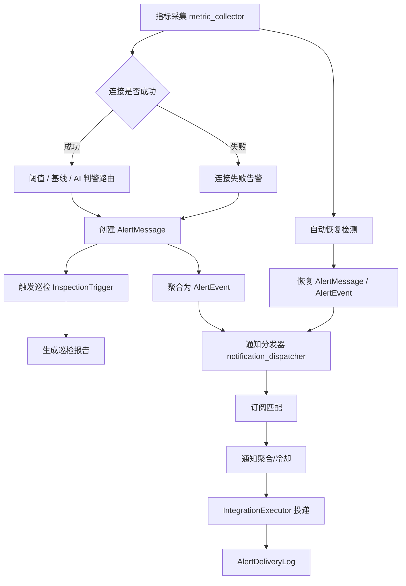

# 告警与通知策略设计文档

## 1. 背景与目标

DBClaw 的告警体系面向数据库实例、主机指标和外部连通性，目标是在减少误报与通知风暴的同时，及时发现数据库异常、触发巡检诊断，并把告警与恢复消息投递到用户配置的通知通道。

本文档基于当前代码实现整理告警生成、事件聚合、自动恢复、AI 判警、通知订阅、通知冷却、静默与投递日志策略，作为后续功能演进和运维配置的设计依据。

说明：本文描述的是“当前实现行为”，其中部分策略带有明显的工程约束或历史兼容痕迹，不等同于未来规划态设计。

## 2. 术语

| 术语 | 说明 |
| --- | --- |
| 告警消息 `AlertMessage` | 单次告警记录，表示某个指标、连接或 AI 策略产生的一条告警。 |
| 告警事件 `AlertEvent` | 对同一数据源、同一指标或同一告警类型的多条告警做时间窗口聚合后的事件。 |
| 巡检触发 `InspectionTrigger` | 告警或计划任务触发的巡检任务入口。 |
| 告警模板 `AlertTemplate` | 巡检配置的模板化载体，可统一下发阈值、AI 判警、基线与事件诊断配置。 |
| 告警订阅 `AlertSubscription` | 用户维度的通知策略，定义数据源、级别、时间段和集成目标。 |
| 集成目标 `IntegrationTarget` | 订阅中的具体投递目标，例如邮件、Webhook、钉钉、飞书、企业微信等 Integration。 |
| 投递日志 `AlertDeliveryLog` | 记录每次告警或恢复通知的目标、状态、错误和发送时间。 |
| 数据源静默 | 数据源级别的临时抑制告警与通知机制；当前实现不停止指标采集。 |

## 3. 总体架构



核心后台任务：

- 指标采集器：按 `METRIC_INTERVAL` 采集数据库状态与可选 SSH/OS 指标。
- 巡检服务：按数据源巡检计划定时触发报告生成，并接收异常触发。
- 通知分发器：每 30 秒扫描待通知告警与最近恢复告警。
- 集成调度与机器人服务：负责外部系统集成及 IM 机器人相关能力。

## 4. 告警数据模型

### 4.1 `AlertMessage`

关键字段：

| 字段 | 说明 |
| --- | --- |
| `datasource_id` | 数据源 ID；全局网络探针告警使用 `0`。 |
| `alert_type` | `threshold_violation`、`baseline_deviation`、`custom_expression`、`system_error`、`ai_policy_violation`。 |
| `severity` | `critical`、`high`、`medium`、`low`。 |
| `metric_name` | 触发指标，如 `cpu_usage`、`connection_status`、`network_probe`。 |
| `metric_value` / `threshold_value` | 触发时当前值和阈值。 |
| `trigger_reason` | 触发原因文本。 |
| `status` | `active`、`acknowledged`、`resolved`。 |
| `event_id` | 关联的聚合事件。 |
| `notified_at` | 首次成功通知完成时间；用于待通知扫描与恢复通知判断。 |
| `resolved_at` / `resolved_value` | 恢复时间和恢复时指标值。 |

### 4.2 `AlertEvent`

事件用于减少告警碎片化，并承载 AI 诊断结果。

| 字段 | 说明 |
| --- | --- |
| `aggregation_key` | 聚合键，优先 `datasource_id:metric_name`，否则 `datasource_id:alert_type`。 |
| `first_alert_id` / `latest_alert_id` | 首条与最新告警。 |
| `alert_count` | 事件内告警数量。 |
| `event_started_at` / `event_ended_at` | 事件开始与最近发生/结束时间。 |
| `status` / `severity` | 继承和更新自事件内告警。 |
| `event_category` / `fault_domain` | 根据告警类型和指标推断的事件分类。 |
| `lifecycle_stage` | `active`、`acknowledged`、`recovered` 等生命周期阶段。 |
| `ai_diagnosis_summary` / `root_cause` / `recommended_actions` | 事件级 AI 诊断结果。 |
| `is_diagnosis_refresh_needed` | 告警升级或事件变化后是否需要刷新诊断。 |

### 4.3 `AlertSubscription`

通知订阅以用户为主体配置。

| 字段 | 说明 |
| --- | --- |
| `datasource_ids` | 为空表示全部数据源；系统级 `datasource_id=0` 不受该过滤限制。 |
| `severity_levels` | 为空表示全部级别。 |
| `time_ranges` | 为空表示 7x24；否则按星期与 `HH:MM` 时间段过滤。 |
| `integration_targets` | 具体通知目标列表。 |
| `is_enabled` | 订阅是否启用。 |
| `aggregation_script` | 自定义通知聚合脚本。 |

### 4.4 `AlertDeliveryLog`

每个订阅目标的投递结果都会记录日志，包括 `alert_id`、`subscription_id`、`integration_id`、`target_id`、`channel`、`recipient`、`status`、`error_message`、`sent_at`。

## 5. 告警生成策略

### 5.1 阈值告警

阈值规则配置在 `InspectionConfig.threshold_rules` 或生效后的告警模板中，支持多级阈值：

```json
{
  "cpu_usage": {
    "levels": [
      {"severity": "medium", "threshold": 70, "duration": 300},
      {"severity": "high", "threshold": 85, "duration": 180},
      {"severity": "critical", "threshold": 95, "duration": 60}
    ]
  }
}
```

当前策略：

1. 同一指标按严重程度从高到低匹配，只产生最高命中的级别。
2. 指标值必须 `>` 阈值才视为违规。
3. 违规持续时间达到 `duration` 后才触发。
4. 内存态触发冷却为 1 小时，避免同一数据源、同一指标、同一级别反复触发。
5. 若同一数据源、同一指标已有 `active` 或 `acknowledged` 的阈值告警，不再创建重复告警，只更新事件最近发生时间。
6. 创建告警后触发 `anomaly` 类型巡检，巡检报告与告警关联。
7. 若规则中没有显式级别，按超过阈值百分比计算级别：超过 100% 为 `critical`，超过 50% 为 `high`，超过 20% 为 `medium`，否则 `low`。

### 5.2 自定义表达式告警

`threshold_rules.custom_expression` 支持 Python 表达式形式：

```json
{
  "custom_expression": {
    "expression": "cpu_usage > 50 and connections > 20",
    "duration": 60
  }
}
```

表达式持续为真且达到 `duration` 后触发，触发后同样进入 1 小时冷却。表达式告警使用 `metric_name=custom_expression`。

### 5.3 基线偏离告警

当 `baseline_config.enabled=true` 时，系统会为当前时间槽刷新或读取基线画像，并检测指标是否超过该实例基线窗口上界。

当前策略：

1. 告警类型为 `baseline_deviation`。
2. 告警内容包含当前值、上界、P95、样本数和时间槽。
3. 默认级别来自检测结果，否则为 `medium`。
4. 同一数据源、同一指标已有活跃或已确认基线告警时不重复创建，只更新时间。
5. 创建后触发 `baseline` 类型巡检。

### 5.4 连接失败告警

指标采集连接数据库失败时：

1. 将数据源 `connection_status` 标记为 `failed`，记录 `connection_error` 与检查时间。
2. 创建 `system_error` / `critical` 告警，`metric_name=connection_status`，`metric_value=0`，`threshold_value=1`。
3. 如果同一数据源已有活跃或已确认连接失败告警，则不重复创建，只更新事件最近发生时间。
4. 创建后触发 `connection_failure` 类型巡检。
5. 连接失败期间如果仍能采集 OS 指标，会先尝试自动恢复已恢复的阈值告警，避免数据库不可连时遗留旧告警。

### 5.5 网络探针告警

网络探针失败时创建全局 `system_error` / `critical` 告警：

- `datasource_id=0`
- `metric_name=network_probe`
- 同一时间只保留一个活跃网络探针告警，持续失败时只更新时间。

### 5.6 AI 判警

AI 判警由 `InspectionConfig.alert_engine_mode` 控制：

| 模式 | 说明 |
| --- | --- |
| `inherit` | 继承默认系统配置或模板配置。 |
| `threshold` | 使用传统阈值/基线策略。 |
| `ai` | 使用 AI 判警策略。 |

AI 策略来源：

- `inline`：直接在数据源巡检配置中填写 `ai_policy_text`。
- `template`：引用 `AlertAIPolicy` 模板。

AI 判警流程：

1. 根据策略编译出结构化触发画像，包括关注指标、触发条件、恢复条件、升级规则和兜底模式。
2. 候选门控先判断是否需要调用模型：直接命中触发条件、接近阈值且趋势恶化、趋势异常、恢复候选等。
3. 调用配置的 AI 模型，模型返回 `decision=alert|no_alert|recover`、级别、置信度、原因、证据和是否触发巡检。
4. 置信度必须达到系统配置 `ai_alert_confidence_threshold`，默认 `0.7`。
5. 需要连续确认达到要求后才触发或恢复，默认需要 2 次确认。
6. 触发后创建 `ai_policy_violation` 告警，并可按模型返回值触发巡检。
7. 恢复后设置 AI 运行态冷却，默认 900 秒（15 分钟），防止恢复后立即反复触发。
8. 评估过程写入 `AlertAIEvaluationLog`，运行状态写入 `AlertAIRuntimeState`。

AI 判警支持影子模式 `ai_shadow_enabled`，但当前只在 `threshold` 引擎模式下作为旁路评估执行：正式告警仍由阈值/基线逻辑产生，AI 仅记录评估日志，不创建正式 AI 告警，也不更新正式运行态冷却。

## 6. 告警事件聚合策略

告警创建后会立即进入事件聚合：

1. 聚合键优先使用 `datasource_id:metric_name`，没有指标时使用 `datasource_id:alert_type`。
2. 默认聚合时间窗口来自 `ALERT_AGGREGATION_TIME_WINDOW_MINUTES`，默认 5 分钟。
3. 只聚合 `active` 或 `acknowledged` 事件，不聚合已恢复事件。
4. 命中已有事件时更新最新告警、事件结束时间、告警数量和严重程度。
5. 未命中时创建新事件。
6. 重复告警被抑制但异常仍持续时，采集逻辑会更新事件 `event_ended_at`，用于表示持续异常。
7. 事件分类策略：
   - 连接或系统错误：`availability`
   - 磁盘/存储指标：`storage`
   - 复制延迟：`replication`
   - CPU、内存、连接、QPS、TPS：`performance`
   - 基线偏离：`baseline`
   - AI 策略：`ai_policy`
   - 其他：`general`

### 6.1 事件级自动诊断刷新策略

事件不仅用于聚合告警，也承载事件级 AI 诊断结果。

默认刷新策略：

1. `event_ai_config.enabled=true`。
2. 新事件创建时默认允许触发诊断刷新。
3. 事件级别升级时默认允许重新诊断。
4. 事件恢复时默认不触发重新诊断。
5. 若事件已有诊断结果且未标记刷新，活跃事件在诊断结果陈旧超过 `stale_recheck_minutes=30` 分钟后可再次诊断。

通知分发与事件诊断的配合方式：

1. 活跃告警发送前，若存在 `event_id` 且数据源仍存在，通知分发器会优先尝试同步诊断或复用已有事件诊断结果。
2. 告警首次成功发出后，如果事件仍被判定为“需要刷新诊断”，系统会异步补充触发一次后台自动诊断，供 UI 和后续通知复用。

## 7. 自动恢复策略

### 7.1 连接恢复

数据库连接恢复成功后，系统自动恢复该数据源下所有活跃或已确认的连接失败告警。

### 7.2 阈值恢复

每次成功采集指标并完成当前违规检测后，系统检查活跃阈值告警：

1. 如果当前指标仍在违规列表中，不恢复。
2. 如果当前值缺失，不恢复。
3. 多级阈值恢复时以最低级别阈值作为恢复线。
4. 当前值 `<` 恢复阈值时，自动将告警标记为 `resolved` 并记录 `resolved_value`。

### 7.3 基线恢复

基线告警根据当前基线检测结果自动恢复：当前指标不再违反对应基线条件时恢复。

### 7.4 AI 判警恢复

AI 返回 `recover` 且置信度达标、连续恢复确认次数满足要求后，恢复当前 AI 告警并更新运行态冷却。

### 7.5 事件恢复

当某事件下所有告警都为 `resolved` 时，事件自动转为 `resolved`，生命周期进入 `recovered`。

## 8. 巡检触发与去重策略

异常告警通常会触发巡检报告：

| 触发类型 | 来源 |
| --- | --- |
| `scheduled` | 巡检服务按 `schedule_interval` 定时触发。 |
| `anomaly` | 阈值告警触发。 |
| `baseline` | 基线偏离触发。 |
| `connection_failure` | 数据库连接失败触发。 |

去重策略：

1. `anomaly` 和 `connection_failure` 会检查近期重复触发。
2. 去重窗口由系统配置 `inspection_dedup_window_minutes` 控制，默认 60 分钟。
3. 阈值异常按数据源、触发类型和指标名去重。
4. 连接失败按数据源和触发类型去重。
5. 命中重复时复用已有触发记录，不创建新的巡检触发。

## 9. 通知订阅匹配策略

通知分发器每 30 秒执行一次，处理待通知告警和最近恢复告警。

告警通知候选：

- `status=active`
- `notified_at` 为空，或早于 `notification_cooldown_minutes` 对应的截止时间

恢复通知候选：

- `status=resolved`
- `resolved_at` 在最近 60 分钟内
- `notified_at` 非空，即原始告警至少有一次成功通知

订阅匹配条件：

1. 订阅必须启用。
2. 数据源匹配：`datasource_ids` 为空表示全部；`datasource_id=0` 的系统告警绕过数据源过滤。
3. 严重级别匹配：`severity_levels` 为空表示全部。
4. 时间段匹配：`time_ranges` 为空表示 7x24；否则需要当前星期和时间落入配置范围。
5. 数据源处于静默期时跳过通知；静默过期后自动清理静默字段。

补充说明：

- 时间段匹配基于应用当前本地时间。
- 当前实现仅支持同一天内的 `start <= end` 时间窗口，不支持跨午夜时间段（例如 `22:00-06:00`）。

## 10. 通知聚合与冷却策略

默认通知聚合由 `AggregationEngine` 执行。

### 10.1 默认聚合规则

1. 只在同一活跃事件内执行冷却抑制，不跨已恢复事件抑制。
2. 如果事件内已有成功投递，检查最近一次投递时间。
3. 若当前告警级别高于该事件历史已通知最高级别，则立即允许发送。
4. 若未升级且距离上次发送小于 `notification_cooldown_minutes`，则抑制。
5. 若冷却窗口已过，则允许再次通知。
6. 无 `event_id` 的告警不做跨事件冷却抑制，直接允许发送。

系统默认 `notification_cooldown_minutes=60`。

### 10.2 单告警订阅级去重

发送前还会检查同一 `alert_id + subscription_id` 在冷却窗口内是否已有成功投递，避免同一告警对同一订阅重复发送。

### 10.3 自定义聚合脚本

订阅可配置 `aggregation_script` 覆盖默认聚合逻辑。脚本执行上下文包含：

- 当前告警信息
- 当前订阅最近 24 小时投递历史
- 最近 10 分钟同数据源、同类型相似告警数量
- 当前时间信息

脚本返回是否发送。该能力适合实现更复杂的降噪策略，例如“10 分钟内同类告警超过 3 条才发送”或“夜间只发送 critical”。

## 11. 通知投递策略

当前通知投递统一委托 Integration 系统执行。

### 11.1 告警通知

发送前会构造通知负载，主要字段包括：

- 标题、内容、严重级别、告警状态
- 数据源名称、告警 ID
- 告警详情页公开链接、关联巡检报告公开链接
- 告警类型、指标名、当前值、阈值、触发原因
- AI 诊断摘要、根因、处置建议
- AI 判警关注指标的原生指标摘要

连接失败告警会特殊格式化为“数据库连接失败”，并突出错误详情。

发送前置处理：

1. 若告警有关联事件，分发器会优先读取事件已有诊断结果；当事件被判断为需要刷新时，会先尝试同步诊断。
2. 订阅匹配、事件级通知冷却、自定义聚合脚本和单告警订阅级去重均通过后，才会真正进入 Integration 投递。
3. 只要某条告警至少有一个目标成功投递，就会回填 `AlertMessage.notified_at`，后续恢复通知也以此作为“原始告警曾成功送达”的判断依据。

### 11.2 恢复通知

恢复通知发送条件更严格：

1. 订阅匹配当前恢复告警。
2. 该订阅曾成功收到原始告警通知。
3. 该订阅尚未收到该告警的恢复通知。
4. 目标 `notify_on` 包含 `recovery`。

恢复负载包含告警类型、严重程度、原告警内容、恢复值、告警时间、恢复时间和 AI 总结。

### 11.3 Integration 目标

订阅中的每个目标结构如下：

```json
{
  "target_id": "ops-dingtalk-1",
  "integration_id": 1,
  "name": "DBA 钉钉群",
  "enabled": true,
  "notify_on": ["alert", "recovery"],
  "params": {}
}
```

投递过程：

1. 跳过禁用目标。
2. 根据 `notify_on` 判断是否发送告警或恢复消息。
3. 校验 Integration 是否存在且启用。
4. 校验 Integration 必填参数。
5. 调用 `IntegrationExecutor.execute_notification` 执行通知代码。
6. 写入 Integration 执行日志和 `AlertDeliveryLog`。

## 12. 静默策略

数据源支持临时静默：

- 设置接口：`POST /api/datasources/{datasource_id}/silence`
- 取消接口：`DELETE /api/datasources/{datasource_id}/silence`
- 查询状态：数据源详情接口返回 `silence_until` 与 `silence_reason`

静默影响：

1. 当前实现不会因为静默而停止指标采集；采集仍会继续执行，静默仅影响告警和通知相关路径。
2. 阈值检查会跳过处于静默期的数据源。
3. 连接失败告警创建会跳过处于静默期的数据源。
4. 通知分发会跳过处于静默期的数据源。
5. 静默到期后会自动清理 `silence_until` 和 `silence_reason`。

当前实现边界：

- 静默判断已覆盖阈值检查、连接失败告警和通知分发。
- 当前未在 AI 正式判警入口统一做静默拦截；若数据源启用 `ai` 作为正式告警引擎，仍可能生成 AI 告警记录，但通知阶段依然会被静默抑制。

## 13. 系统配置项

| 配置项 | 默认值 | 类别 | 说明 |
| --- | --- | --- | --- |
| `inspection_dedup_window_minutes` | `60` | `inspection` | 巡检触发去重窗口。 |
| `default_alert_engine_mode` | `threshold` | `alerting` | 默认告警引擎模式：`threshold` 或 `ai`。 |
| `ai_alert_timeout_seconds` | `3` | `alerting` | AI 判警请求超时时间。 |
| `ai_alert_confidence_threshold` | `0.7` | `alerting` | AI 判警最低置信度阈值。 |
| `notification_cooldown_minutes` | `60` | `alerting` | 同一事件通知冷却窗口，严重级别升级可绕过。 |
| `smtp_host` / `smtp_port` / `smtp_username` / `smtp_password` / `smtp_from_email` / `smtp_use_tls` | 空或默认端口 | `notification` | 内置邮件通知配置，当前通知主路径通过 Integration 系统投递。 |

环境级默认值还包括：

| 环境变量 | 默认值 | 说明 |
| --- | --- | --- |
| `METRIC_INTERVAL` | `60` 秒 | 指标采集间隔。 |
| `ALERT_AGGREGATION_TIME_WINDOW_MINUTES` | `5` 分钟 | 告警事件聚合窗口。 |
| `INSPECTION_DEDUP_WINDOW_MINUTES` | `60` 分钟 | 巡检触发去重窗口的初始默认值。 |

补充说明：

- AI 判警的“连续确认次数=2”和“恢复后冷却=900 秒”当前是代码内默认值，尚未暴露为系统配置项。

## 14. 管理接口概览

### 14.1 告警与事件

| 接口 | 说明 |
| --- | --- |
| `GET /api/alerts` | 查询告警列表。 |
| `GET /api/alerts/{alert_id}` | 查询单条告警详情。 |
| `POST /api/alerts/{alert_id}/acknowledge` | 确认告警。 |
| `POST /api/alerts/{alert_id}/resolve` | 手动恢复告警。 |
| `GET /api/alerts/events` | 查询告警事件列表。 |
| `GET /api/alerts/events/{event_id}/alerts` | 查询事件内告警。 |
| `POST /api/alerts/events/{event_id}/acknowledge` | 确认事件。 |
| `POST /api/alerts/events/{event_id}/resolve` | 恢复事件。 |
| `GET /api/alerts/events/{event_id}/context` | 查询事件诊断上下文。 |

### 14.2 订阅与通知

| 接口 | 说明 |
| --- | --- |
| `GET /api/alerts/subscriptions/list` | 查询当前用户订阅。 |
| `POST /api/alerts/subscriptions` | 创建订阅。 |
| `PUT /api/alerts/subscriptions/{subscription_id}` | 更新订阅。 |
| `DELETE /api/alerts/subscriptions/{subscription_id}` | 删除订阅。 |
| `POST /api/alerts/subscriptions/{subscription_id}/test` | 发送测试通知。 |

### 14.3 巡检与告警模板

| 接口 | 说明 |
| --- | --- |
| `GET /api/inspections/config/{datasource_id}` | 查询数据源巡检/告警配置。 |
| `POST /api/inspections/config/{datasource_id}` | 创建配置。 |
| `PUT /api/inspections/config/{datasource_id}` | 更新配置。 |
| `GET /api/inspections/templates` | 查询告警模板。 |
| `POST /api/inspections/templates` | 创建告警模板。 |
| `PUT /api/inspections/templates/{template_id}` | 更新告警模板。 |
| `POST /api/inspections/templates/{template_id}/toggle` | 启停模板。 |
| `POST /api/inspections/validate-expression` | 校验自定义表达式。 |

### 14.4 AI 判警策略

| 接口 | 说明 |
| --- | --- |
| `GET /api/alert-ai/policies` | 查询 AI 判警策略模板。 |
| `POST /api/alert-ai/policies` | 创建 AI 判警策略模板。 |
| `PUT /api/alert-ai/policies/{policy_id}` | 更新 AI 判警策略模板。 |
| `POST /api/alert-ai/policies/{policy_id}/toggle` | 启停 AI 判警策略模板。 |
| `POST /api/alert-ai/evaluate-preview` | AI 判警预览评估。 |
| `GET /api/alert-ai/evaluations` | 查询 AI 判警评估日志。 |
| `GET /api/alert-ai/stats` | 查询 AI 判警统计。 |

### 14.5 系统配置与静默

| 接口 | 说明 |
| --- | --- |
| `GET /api/system-configs` | 查询系统配置。 |
| `PUT /api/system-configs/{id}` | 更新系统配置。 |
| `POST /api/datasources/{datasource_id}/silence` | 设置数据源静默。 |
| `DELETE /api/datasources/{datasource_id}/silence` | 取消数据源静默。 |

## 15. 典型场景

### 15.1 CPU 持续高水位

1. 指标采集得到 `cpu_usage=91`。
2. 阈值规则命中 `high` 或 `critical`，并持续达到对应 `duration`。
3. 系统创建阈值告警并聚合到事件。
4. 触发异常巡检并生成报告。
5. 通知分发器运行同步诊断，将 AI 摘要、根因、建议和报告链接发送到订阅目标。
6. CPU 降到最低阈值以下后自动恢复告警。
7. 原来收到告警的订阅目标收到恢复通知。

### 15.2 数据库连接失败

1. 采集器连接数据库失败。
2. 创建 `critical` 连接失败告警。
3. 同一连接失败持续期间不重复创建告警，只更新事件时间。
4. 通知中突出“数据库连接失败”和错误详情。
5. 连接恢复后自动恢复告警并发送恢复通知。

### 15.3 同一事件内严重级别升级

1. 同一指标先触发 `medium` 并发送通知。
2. 10 分钟后升级到 `critical`，虽然未超过 60 分钟通知冷却，但严重级别升高。
3. 聚合引擎允许立即发送升级通知。

## 16. 当前约束与注意事项

1. 阈值检查的持续时间与冷却状态保存在进程内存，服务重启后会丢失。
2. 阈值恢复使用 `<` 最低阈值，没有独立迟滞区间；边界波动可能导致频繁恢复/触发，需要依赖持续时间和通知冷却降噪。
3. 通知冷却按同一活跃事件生效；事件恢复后再次发生会立即允许新通知。
4. 恢复通知只发给收到过原始告警的订阅，避免“只收恢复不收告警”。
5. 自定义聚合脚本能力较灵活，应限制给可信管理员使用，并在后续加强沙箱与审计。
6. Integration 通知代码属于可编程扩展，需配合权限控制和执行日志审计。
7. 数据源静默适合维护窗口临时抑制告警与通知，但当前实现不会停止指标采集；不适合长期替代监控治理。
8. 订阅时间段过滤不支持跨午夜窗口，夜间值班场景需要拆成两个时间段配置。
9. AI 判警依赖模型可用性与策略质量，建议先通过预览和影子模式验证后再启用正式模式。
10. 静默能力当前未完全覆盖 AI 正式判警入口，若采用 AI 引擎需要额外关注静默期间是否产生仅落库不通知的 AI 告警。

## 17. 后续优化建议

1. 将阈值违规持续状态持久化，避免服务重启后重新计时。
2. 为阈值恢复增加独立恢复阈值或迟滞比例，降低边界抖动。
3. 增加通知策略可视化预览，展示某条告警会匹配哪些订阅、被哪些规则抑制。
4. 为自定义聚合脚本提供更严格的沙箱、超时和审计。
5. 增加按事件维度的恢复通知摘要，减少多指标恢复时的消息数量。
6. 提供默认订阅模板，降低首次配置成本。
