# DBClaw 数据库说明文档

更新时间：2026-04-15

## 1. 文档目的

本文档用于说明 DBClaw 当前元数据库的生成方式、主要设计约定、核心表用途以及表之间的关键关系。

说明范围以当前代码中的 ORM 模型和启动迁移逻辑为准，重点覆盖：

- 应用启动时自动创建的业务表
- 启动迁移维护的结构补丁表
- 主要领域模型、关键字段和数据流向

不重点覆盖：

- 历史迁移过程中可能短暂出现的临时表、归档表
- PostgreSQL 系统表

## 2. 表结构是如何生成的

DBClaw 当前没有采用集中式 `schema.sql` 或 Alembic 目录来统一建表，而是使用“启动自动建表 + 启动迁移补齐”的机制。

启动链路如下：

1. 入口 `run.py` 启动 FastAPI 应用。
2. 应用 `lifespan` 启动时调用 `init_db()`。
3. `init_db()` 会先导入 `backend.models` 和 `backend.skills.models`，让所有模型注册到 `Base.metadata`。
4. 执行 `Base.metadata.create_all()` 自动创建缺失表。
5. 再执行 `backend/migrations/runner.py` 中登记的启动迁移，对已有库做增量修正。

因此：

- 初始表结构的权威来源是 `backend/models/*.py` 和 `backend/skills/models.py`
- 增量结构变更的权威来源是 `backend/migrations/*.py`
- 迁移执行记录保存在 `startup_migrations` 表中

## 3. 当前库范围

按当前 ORM 元数据统计：

- 业务表共 `35` 张
- 启动迁移记录表 `startup_migrations` 共 `1` 张
- 合计可视为当前主库核心表 `36` 张

说明：

- `startup_migrations` 不在 ORM 模型中定义，而是在启动迁移器中通过 SQL 显式创建
- 本文将它作为系统管理表一并说明

## 4. 设计约定

### 4.1 元数据库类型

DBClaw 元数据库仅支持 PostgreSQL。

### 4.2 软删除

以下表使用了软删除字段：

- `users`
- `hosts`
- `datasources`
- `diagnostic_sessions`
- `chat_messages`
- `diagnosis_events`
- `doc_documents`
- `alert_subscriptions`
- `integrations`
- `reports`

软删除公共字段为：

- `is_deleted`
- `deleted_at`
- `deleted_by`

### 4.3 JSON / JSONB 使用较多

项目中大量使用 `JSON` 字段存储规则、快照、工具调用记录、知识路由配置等结构化数据。

其中 `datasources.extra_params` 在 PostgreSQL 下使用 `JSONB` 变体。

### 4.4 外键约束偏少

当前数据库层面只定义了少量物理外键：

- `user_sessions.user_id -> users.id`
- `doc_categories.parent_id -> doc_categories.id`
- `doc_documents.category_id -> doc_categories.id`

其余大量 `*_id` 字段是逻辑关联，而不是数据库强约束。也就是说：

- 代码层承担了大部分关联一致性控制
- 后续如果做 BI、归档、数据治理，需要特别留意这些逻辑关联字段

### 4.5 敏感信息加密存储

以下字段属于典型密文存储字段：

- `datasources.password_encrypted`
- `hosts.password_encrypted`
- `hosts.private_key_encrypted`
- `ai_models.api_key_encrypted`

系统配置表 `system_configs` 还通过 `is_encrypted` 标记某项配置是否加密。

## 5. 核心关系概览

```mermaid
erDiagram
    users ||--o{ user_sessions : "has"
    users ||--o{ login_logs : "writes"
    users ||--o{ diagnostic_sessions : "owns"
    diagnostic_sessions ||--o{ chat_messages : "contains"
    diagnostic_sessions ||--o{ diagnosis_events : "records"
    diagnostic_sessions ||--o{ diagnosis_conclusions : "summarizes"

    hosts ||--o{ host_metrics : "collects"
    hosts ||--o{ datasources : "supports (logical)"
    datasources ||--o{ metric_snapshots : "collects"
    datasources ||--o{ inspection_triggers : "triggers"
    datasources ||--o{ reports : "generates"
    datasources ||--o{ alert_messages : "raises"
    datasources ||--o{ alert_events : "aggregates"
    datasources ||--o{ alert_ai_runtime_states : "tracks"
    datasources ||--o{ alert_ai_evaluation_logs : "evaluates"
    datasources ||--|| inspection_configs : "configures"

    doc_categories ||--o{ doc_categories : "parent"
    doc_categories ||--o{ doc_documents : "contains"

    integrations ||--o{ integration_execution_logs : "executes"
    integrations ||--o{ integration_bot_bindings : "binds"
    diagnostic_sessions ||--o{ chat_channel_bindings : "binds"
```

说明：

- 图中部分关系是业务逻辑关系，不一定有数据库外键
- DBClaw 偏向应用层编排，而不是重度依赖数据库强约束

## 6. 按领域划分的表说明

### 6.1 用户与认证

| 表名 | 用途 | 关键字段 | 备注 |
| --- | --- | --- | --- |
| `users` | 用户主表 | `username`, `password_hash`, `is_admin`, `session_version` | 支持软删除；默认管理员首次启动自动写入 |
| `user_sessions` | 登录会话表 | `user_id`, `session_id_hash`, `status`, `expires_at` | 当前少数真正带外键的表之一 |
| `login_logs` | 登录审计日志 | `user_id`, `login_time`, `ip_address`, `success` | 记录登录结果与来源信息 |

### 6.2 主机、数据源与监控

| 表名 | 用途 | 关键字段 | 备注 |
| --- | --- | --- | --- |
| `hosts` | 主机资产表 | `name`, `host`, `port`, `username`, `auth_type` | 存 SSH 连接信息，密码/私钥加密保存，支持软删除 |
| `host_metrics` | 主机监控快照 | `host_id`, `cpu_usage`, `memory_usage`, `disk_usage`, `data` | `data` 保存完整 OS 指标 JSON |
| `datasources` | 数据源资产表 | `name`, `db_type`, `host`, `port`, `database`, `host_id` | 核心资产表；扩展字段较多；支持软删除 |
| `metric_snapshots` | 数据库监控指标快照 | `datasource_id`, `metric_type`, `data`, `collected_at` | 监控原始/汇总数据主要落库点 |
| `metric_baseline_profiles` | 指标基线画像 | `datasource_id`, `metric_name`, `weekday`, `hour`, `p95_value` | 用于基线分析与事件策略 |

`datasources` 中值得重点关注的业务字段：

- 连接信息：`host`, `port`, `username`, `password_encrypted`, `database`
- 监控来源：`metric_source`, `external_instance_id`, `inbound_source`
- 业务标记：`importance_level`, `remark`, `tags`
- 运维控制：`silence_until`, `silence_reason`
- 连接健康：`connection_status`, `connection_error`, `connection_checked_at`

### 6.3 AI 模型、诊断会话与知识体系

| 表名 | 用途 | 关键字段 | 备注 |
| --- | --- | --- | --- |
| `ai_models` | AI 模型配置 | `name`, `provider`, `protocol`, `base_url`, `model_name`, `is_default` | API Key 加密保存；由前端“AI 大模型管理”维护 |
| `diagnostic_sessions` | AI 诊断会话主表 | `user_id`, `datasource_id`, `ai_model_id`, `title`, `kb_ids` | 诊断对话容器，支持软删除 |
| `chat_messages` | 会话消息表 | `session_id`, `role`, `content`, `run_id`, `tool_calls` | 支持用户消息、AI 消息、工具调用消息，支持软删除 |
| `diagnosis_events` | 诊断运行事件流 | `session_id`, `run_id`, `event_type`, `sequence_no`, `payload` | 用于记录 Agent 执行轨迹，支持软删除 |
| `diagnosis_conclusions` | 诊断结论表 | `session_id`, `run_id`, `summary`, `findings`, `action_items` | 保存最终诊断摘要、证据和行动项 |
| `doc_categories` | 文档分类树 | `name`, `db_type`, `parent_id`, `sort_order` | 文档知识分类结构 |
| `doc_documents` | 文档知识库 | `category_id`, `title`, `content`, `scope`, `doc_kind`, `compiled_snapshot` | 存内置/用户文档，支持软删除 |
| `skills` | 技能定义表 | `id`, `name`, `version`, `permissions`, `code` | Agent 工具定义及执行代码 |
| `skill_executions` | 技能执行日志 | `skill_id`, `session_id`, `user_id`, `result`, `execution_time_ms` | 技能调用审计 |
| `skill_ratings` | 技能评分反馈 | `skill_id`, `user_id`, `rating`, `comment` | 对 `(skill_id, user_id)` 做唯一约束 |

其中：

- `diagnostic_sessions` 是会话主线
- `chat_messages` 记录对话内容
- `diagnosis_events` 记录执行过程
- `diagnosis_conclusions` 记录最终结论

这四张表共同构成 AI 诊断链路的核心数据面。

### 6.4 巡检、告警与报告

| 表名 | 用途 | 关键字段 | 备注 |
| --- | --- | --- | --- |
| `inspection_configs` | 巡检配置表 | `datasource_id`, `enabled`, `schedule_interval`, `threshold_rules` | 每个数据源一条主配置，`datasource_id` 唯一 |
| `inspection_triggers` | 巡检触发表 | `datasource_id`, `trigger_type`, `trigger_reason`, `metric_snapshot`, `processed` | 保存巡检触发原因与处理状态 |
| `alert_templates` | 告警模板 | `name`, `enabled`, `is_default`, `template_config` | 告警策略模板化配置 |
| `alert_ai_policies` | AI 判警策略 | `name`, `rule_text`, `model_id`, `analysis_strategy`, `compile_status` | AI 告警规则定义与编译状态 |
| `alert_ai_runtime_states` | AI 判警运行态 | `datasource_id`, `policy_fingerprint`, `active`, `cooldown_until`, `alert_id` | 跟踪 AI 告警状态机 |
| `alert_ai_evaluation_logs` | AI 判警评估日志 | `datasource_id`, `policy_id`, `decision`, `confidence`, `accepted` | 保存模型评估结果和证据 |
| `alert_messages` | 原始告警消息 | `datasource_id`, `alert_type`, `severity`, `status`, `event_id` | 阈值/AI 告警的基础消息实体 |
| `alert_events` | 告警事件聚合 | `datasource_id`, `aggregation_key`, `alert_count`, `status`, `diagnosis_status` | 将多条告警聚合为事件 |
| `alert_subscriptions` | 告警订阅规则 | `user_id`, `datasource_ids`, `severity_levels`, `integration_targets` | 告警订阅与通知路由，支持软删除 |
| `alert_delivery_logs` | 告警投递日志 | `alert_id`, `subscription_id`, `channel`, `recipient`, `status` | 通知是否发送成功的审计表 |
| `reports` | 巡检/诊断报告 | `datasource_id`, `report_type`, `status`, `content_md`, `alert_id` | 报告产物表，支持软删除 |

这一组表的典型链路是：

1. 监控指标进入 `metric_snapshots`
2. 阈值或 AI 判定生成 `alert_messages`
3. 多条告警聚合成 `alert_events`
4. 命中订阅规则后写入 `alert_delivery_logs`
5. 自动巡检或手动诊断生成 `reports`

`inspection_configs` 中最重要的配置字段有：

- 调度：`schedule_interval`, `last_scheduled_at`, `next_scheduled_at`
- AI 分析：`use_ai_analysis`, `ai_model_id`, `kb_ids`
- 阈值：`threshold_rules`
- 告警引擎路由：`alert_engine_mode`, `ai_policy_source`, `ai_policy_id`, `alert_ai_model_id`
- 增强能力：`baseline_config`, `event_ai_config`, `alert_template_id`

### 6.5 集成、机器人与外部通道

| 表名 | 用途 | 关键字段 | 备注 |
| --- | --- | --- | --- |
| `integrations` | 可编程集成定义 | `integration_id`, `integration_type`, `category`, `code`, `enabled` | 第三方接入与执行逻辑主体，支持软删除 |
| `integration_execution_logs` | 集成执行日志 | `integration_id`, `target_type`, `datasource_id`, `status`, `result` | 记录每次集成执行结果 |
| `integration_bot_bindings` | 集成机器人绑定 | `integration_id`, `code`, `name`, `enabled`, `params` | 机器人绑定配置 |
| `chat_channel_bindings` | 外部聊天通道绑定 | `channel_type`, `external_chat_id`, `session_id`, `integration_id` | 把外部 IM 通道映射到诊断会话 |
| `chat_event_dedups` | 外部事件去重表 | `channel_type`, `external_event_id`, `external_message_id`, `event_type` | 防止飞书/微信等回调重复消费 |

### 6.6 系统配置与平台元信息

| 表名 | 用途 | 关键字段 | 备注 |
| --- | --- | --- | --- |
| `system_configs` | 系统配置中心 | `key`, `value`, `value_type`, `category`, `is_encrypted` | 启动时会自动写入默认配置 |
| `startup_migrations` | 启动迁移执行记录 | `name`, `applied_at` | 由迁移执行器直接创建，用于幂等控制 |

## 7. 当前主表明细补充

### 7.1 `users`

用户主表，保存账号、身份和软删除状态。

关键字段：

- `username`：登录名，唯一
- `password_hash`：密码哈希
- `is_admin`：是否管理员
- `session_version`：会话版本，适用于统一失效旧登录态

### 7.2 `datasources`

平台最核心的资产表之一，用于描述被管理数据库实例。

典型场景：

- 连接数据库实例
- 挂接主机 SSH 信息
- 决定监控来源与采集方式
- 作为巡检、告警、AI 诊断的核心关联主体

### 7.3 `metric_snapshots`

用于保存数据库监控数据快照，`data` 字段承载结构化指标内容，`metric_type` 区分数据类型，例如：

- `db_status`
- `os_metrics`
- `slow_queries`

### 7.4 `diagnostic_sessions` / `chat_messages`

这是 AI 对话的主数据结构：

- `diagnostic_sessions` 保存会话级上下文
- `chat_messages` 保存消息级内容

`chat_messages.role` 支持：

- `user`
- `assistant`
- `tool_call`
- `tool_result`
- `approval_request`
- `approval_response`

### 7.5 `alert_messages` / `alert_events`

两者关系可以理解为：

- `alert_messages` 是原子告警
- `alert_events` 是聚合后的告警事件

其中 `alert_events` 还承载 AI 诊断结果，如：

- `ai_diagnosis_summary`
- `root_cause`
- `recommended_actions`
- `diagnosis_status`

### 7.6 `reports`

保存巡检或诊断生成的报告结果，可关联：

- 数据源
- AI 模型
- 告警
- 触发来源
- 技能执行轨迹

## 8. 索引与唯一性说明

当前模型中索引策略主要体现在以下几类字段：

- 高频筛选字段：`status`, `enabled`, `is_deleted`, `datasource_id`, `user_id`
- 时间字段：`created_at`, `collected_at`, `triggered_at`, `expires_at`
- 业务唯一字段：`users.username`, `ai_models.name`, `integration_bot_bindings.code`
- 幂等/聚合字段：`alert_events.aggregation_key`, `alert_ai_runtime_states.policy_fingerprint`

显式唯一约束包括但不限于：

- `users.username`
- `ai_models.name`
- `inspection_configs.datasource_id`
- `skill_ratings(skill_id, user_id)`
- `metric_baseline_profiles(datasource_id, metric_name, weekday, hour)`
- `alert_ai_runtime_states(datasource_id, policy_fingerprint)`

## 9. 启动迁移机制说明

项目未采用 Alembic，而是通过 `backend/migrations/runner.py` 维护启动迁移列表。

其特点：

- 启动时自动执行
- 使用 PostgreSQL advisory lock 避免并发迁移冲突
- 已执行迁移会写入 `startup_migrations`
- 单个迁移失败时会记录日志并继续后续流程，不一定阻断整个启动

因此在维护数据库结构时，推荐遵循以下原则：

1. 新增完整新表时，优先在 ORM 模型中定义
2. 已上线表增量改字段时，同时补充启动迁移脚本
3. 文档、模型、迁移三者保持同步

## 10. 维护建议

如果后续要继续演进数据库层，建议优先做这几件事：

1. 为高价值逻辑关联逐步补充外键或至少补充文档级关联说明
2. 补一份自动化“模型转数据字典”脚本，减少文档手工维护成本
3. 对历史归档表、废弃字段、迁移遗留结构做一次集中清理
4. 为监控、告警、会话等大表补充容量规划和归档策略说明

## 11. 代码定位

和数据库结构最相关的代码入口如下：

- `backend/database.py`：数据库初始化与 `create_all`
- `backend/models/`：主业务模型
- `backend/skills/models.py`：技能系统模型
- `backend/migrations/runner.py`：启动迁移注册与执行器
- `backend/app.py`：应用启动流程

## 12. 结论

DBClaw 当前数据库的核心特点是：

- 以 ORM 模型作为主结构来源
- 以启动迁移作为增量修正机制
- 以 PostgreSQL JSON 能力承载大量灵活配置和快照数据
- 以应用层逻辑关联为主，数据库强外键较少

这套设计非常适合当前产品快速演进，但也意味着后续做数据治理、报表分析和历史归档时，需要更强的文档和迁移纪律来保障一致性。
