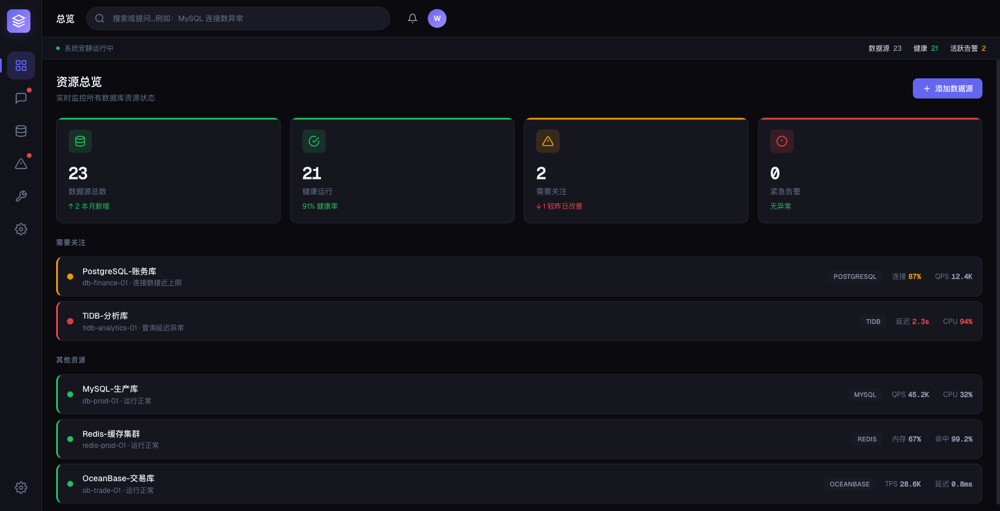
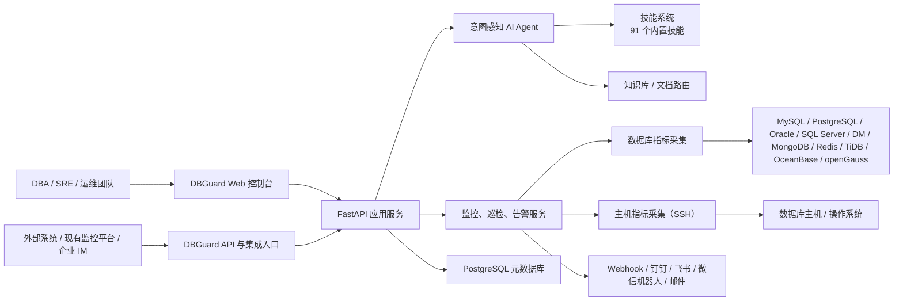
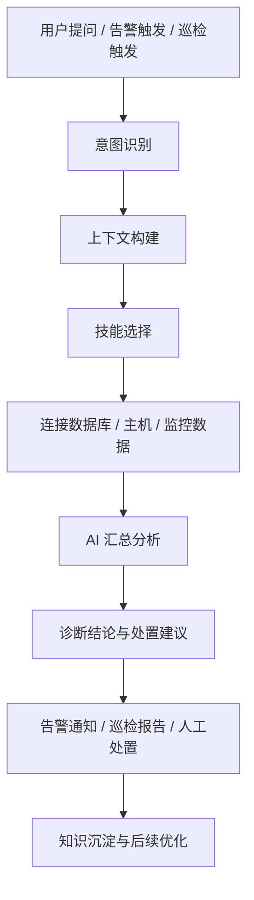
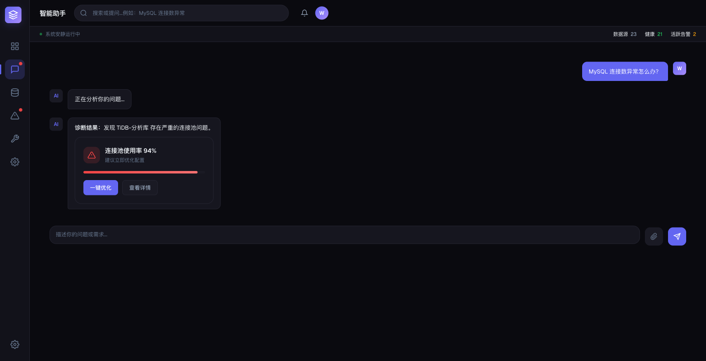
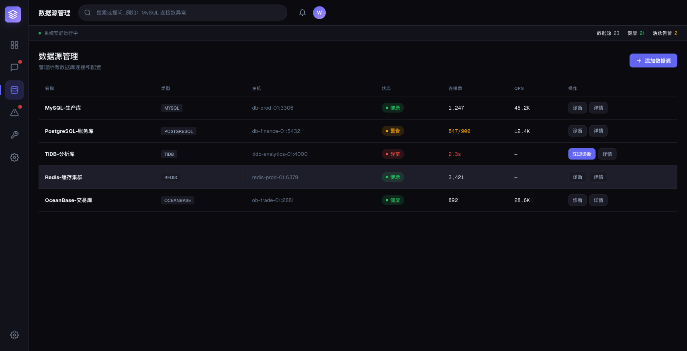
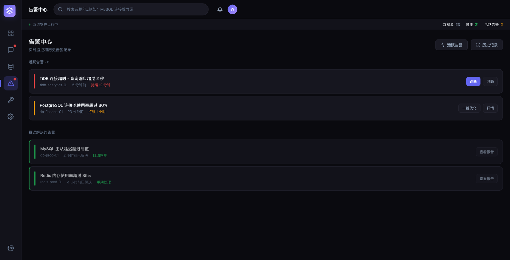
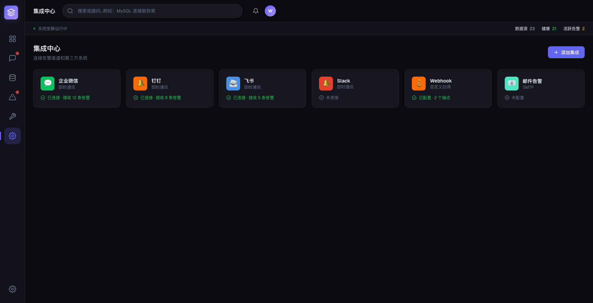

# DBGuard 产品介绍

> 面向现代企业数据库运维的 AI 原生平台  
> 更新时间：2026-04-10

DBGuard 是一款 AI 驱动的数据库运维平台，围绕“监控、告警、巡检、诊断、知识沉淀、集成联动”打造统一工作台，帮助 DBA、SRE 和平台团队更快发现问题、更准定位根因、更稳完成日常运维。

## 一句话介绍

DBGuard 将数据库监控、AI 智能诊断、自动巡检、告警通知、知识库和外部集成整合到一个平台中，让数据库运维从“依赖个人经验”升级为“可复制、可沉淀、可扩展”的系统能力。

## 产品定位

| 维度 | 说明 |
| --- | --- |
| 产品类型 | AI 驱动的数据库运维与诊断平台 |
| 目标用户 | DBA、SRE、运维工程师、平台工程团队、值班团队 |
| 核心目标 | 缩短故障定位链路、提升日常巡检效率、降低告警噪音、统一多数据库运维入口 |
| 适用环境 | 私有化部署、混合云环境、多数据库并存场景、对运维标准化要求较高的企业 |
| 产品形态 | FastAPI 后端 + 原生 JavaScript 前端 + PostgreSQL 元数据库 |

## 为什么需要 DBGuard

- 数据库类型越来越多，MySQL、PostgreSQL、Oracle、SQL Server、国产数据库往往并存，传统工具难以统一纳管。
- 运维工作高度依赖个人经验，故障发生时容易出现“告警很多、结论很少、定位很慢”的情况。
- 监控、告警、巡检、文档、通知分散在多个系统中，团队需要频繁切换工具。
- 经验沉淀不足，值班交接、跨团队协作和新人 onboarding 成本高。

DBGuard 的目标不是再做一个“只会画图表”的监控系统，而是打造一个能理解问题、调用工具、整合上下文并输出可执行结论的数据库运维平台。

## 核心价值

| 核心价值 | 对用户意味着什么 |
| --- | --- |
| 更快定位故障 | 通过 AI 对话式诊断、实时指标和技能调用，把排障流程从“人工找线索”变成“系统辅助定位” |
| 更早发现风险 | 借助自动巡检、阈值规则、实时采集和告警闭环，在故障扩大前发现隐患 |
| 更统一的运维入口 | 将多数据库管理、主机监控、告警处理、知识库和通知整合到一个平台中 |
| 更可持续的能力沉淀 | 通过技能系统、知识库和集成机制，把个人经验沉淀为团队可复用能力 |

## 核心能力全景

| 模块 | 主要能力 | 用户收益 |
| --- | --- | --- |
| AI 智能诊断 | 自然语言问答、意图识别、上下文构建、技能自动选择、诊断结论输出 | 值班时不必从零排查，能更快得到方向明确的诊断建议 |
| 主动监控 | 持续采集数据库指标与主机指标，支持 WebSocket 实时展示 | 第一时间掌握实例健康状态与异常趋势 |
| 智能巡检 | 定时巡检、阈值触发、AI 辅助分析、结构化巡检报告 | 把日常健康检查从人工执行变为自动化流程 |
| 告警中心 | 告警聚合、去重、自动恢复、历史追溯、通知分发 | 减少告警风暴，提升告警有效性 |
| 多数据库统一管理 | 统一管理连接、状态、标签、主机关联、连接测试 | 多数据库环境下仍能保持统一运维视角 |
| 技能系统 | 当前内置 91 个技能定义，支持 YAML 声明式扩展和权限控制 | 能力可扩展，适合逐步沉淀企业自有诊断方法 |
| 知识库增强 | 文档导入、知识路由、对话上下文增强 | 让 AI 诊断更贴合企业内部规范和经验 |
| 外部集成 | Webhook、钉钉、飞书、微信机器人、邮件，以及可编程适配器 | 便于融入企业既有通知链路和监控体系 |

## 支持的数据库类型

DBGuard 当前支持统一纳管以下主流数据库：

- MySQL
- PostgreSQL
- Oracle
- SQL Server
- 达梦（DM）
- MongoDB
- Redis
- TiDB
- OceanBase
- openGauss

这意味着无论企业环境是开源数据库、商业数据库还是国产数据库混合部署，都可以在同一个平台中完成监控、巡检和诊断工作。

## 产品亮点

### 1. AI 原生，而不是传统监控的附属插件

DBGuard 的 AI 能力并不是简单接入一个对话框，而是与意图识别、技能执行、知识库和诊断上下文深度结合。用户既可以直接提问“为什么数据库变慢了”，也可以围绕具体实例持续追问，平台会自动组合可用能力给出回答。

### 2. 监控、诊断、巡检、告警在同一个闭环内完成

从指标采集，到异常发现，到 AI 诊断，再到通知分发和巡检报告，DBGuard 形成完整链路，避免团队在多个系统之间来回切换。

### 3. 多数据库统一运维，兼顾国产数据库场景

平台面向多数据库场景设计，不仅支持 MySQL、PostgreSQL、Oracle、SQL Server，也覆盖 DM、openGauss、TiDB、OceanBase 等环境，更适合中国企业的真实数据库现状。

### 4. 开放扩展能力强

平台提供两类扩展机制：

- 技能系统：用于扩展数据库诊断、查询、系统管理等 AI 工具能力。
- 适配器系统：用于接入第三方监控平台、云厂商 API 或企业内部系统。

## 产品架构

### 总体架构图

### AI 诊断与运维闭环

## 产品截图

> 以下截图为演示环境示意，数据仅用于展示。

### 1. 资源总览

资源总览页面帮助团队快速查看数据库资源规模、健康状态、活跃告警和重点关注实例，适合作为日常值班和管理驾驶舱入口。

### 2. AI 智能诊断

用户可以直接使用自然语言描述问题，平台会结合当前实例状态、监控数据和技能能力给出诊断结论与后续建议，显著降低排障门槛。

### 3. 数据源统一管理

数据源管理页面支持统一查看实例类型、状态、连接数、QPS 等关键指标，便于在多数据库环境下集中管理和快速筛选重点实例。

### 4. 告警中心

告警中心统一呈现活跃告警与恢复记录，帮助团队快速判断异常优先级，并结合平台的聚合、去重和自动恢复机制提升告警处理效率。

### 5. 集成中心

集成中心支持配置通知与机器人能力，方便将 DBGuard 纳入企业现有的协同与通知体系，实现监控事件的自动分发和联动。

## 典型应用场景

### 场景一：生产故障快速定位

当数据库响应变慢、连接数异常或慢查询激增时，运维人员可以直接在 AI 诊断页面描述现象。DBGuard 会自动结合监控数据、技能执行结果和上下文信息生成诊断思路，帮助团队更快锁定问题来源。

### 场景二：日常巡检自动化

对核心数据库设置固定巡检计划后，平台可以按周期执行健康检查，并输出结构化报告。团队不再需要手工逐项检查连接数、负载、空间使用率和历史异常，能把精力集中在真正需要处理的问题上。

### 场景三：多数据库统一纳管

对于同时使用 MySQL、PostgreSQL、Oracle、国产数据库的企业，DBGuard 可以将不同数据库统一纳入同一视图，降低工具切换成本，让管理、监控、诊断和告警处理流程标准化。

### 场景四：接入现有运维体系

如果企业已经有现成的监控平台、云厂商指标体系或内部通知系统，DBGuard 可以通过可编程适配器和集成机制对接外部能力，在不推翻原有体系的前提下补齐 AI 诊断与运维闭环。

## 部署与安全能力

| 维度 | 说明 |
| --- | --- |
| 部署方式 | 支持源码部署，也支持单容器 Docker 部署 |
| 元数据存储 | 使用 PostgreSQL 存储平台元数据 |
| 前端架构 | 原生 JavaScript SPA，无需额外构建步骤，便于部署与排障 |
| 后端架构 | FastAPI 全异步架构，适合实时监控与并发请求处理 |
| 安全机制 | 数据库密码采用 Fernet 加密存储，平台使用 JWT 做认证鉴权 |
| 主机接入 | 支持通过 SSH 采集主机级指标，便于数据库与主机状态联动分析 |
| 扩展方式 | 支持 YAML 技能扩展与 Python 适配器扩展 |

## 为什么适合企业推广落地

- 轻量：前后端结构清晰，部署门槛相对较低，适合从单团队试点开始。
- 可扩展：技能和适配器机制适合逐步沉淀企业自己的运维方法论。
- 可私有化：适合对数据安全、内部流程和模型接入方式有要求的企业环境。
- 易推广：对 DBA 和运维工程师友好，也能让平台团队、管理者从统一视图中看到整体健康情况。

## 总结

DBGuard 不是简单把大模型接到数据库工具上，而是把数据库监控、AI 诊断、自动巡检、告警闭环、知识沉淀和外部集成组织成一个完整的平台。

对企业而言，DBGuard 带来的价值并不只是“看见问题”，更重要的是：

- 让数据库问题更早被发现
- 让故障定位更快形成结论
- 让运维经验更容易复制和沉淀
- 让多数据库环境拥有统一的运维入口

## 对外宣传短文案

### 50 字版

DBGuard 是一款 AI 驱动的数据库运维平台，集监控、告警、巡检、智能诊断和外部集成为一体，帮助企业更快发现问题、更准定位根因。

### 150 字版

DBGuard 面向现代企业数据库运维场景，提供 AI 智能诊断、实时监控、自动巡检、告警闭环、多数据库统一管理和开放集成能力。平台支持 MySQL、PostgreSQL、Oracle、SQL Server、达梦、TiDB、OceanBase、openGauss 等多种数据库，并通过技能系统与知识库持续沉淀运维经验，帮助 DBA 和运维团队从被动响应走向主动预防。
