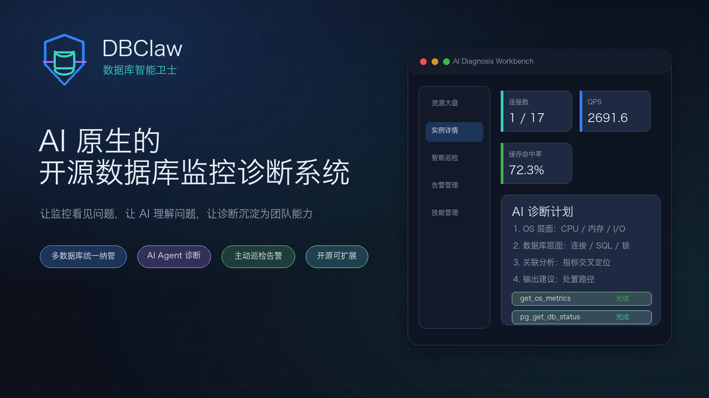
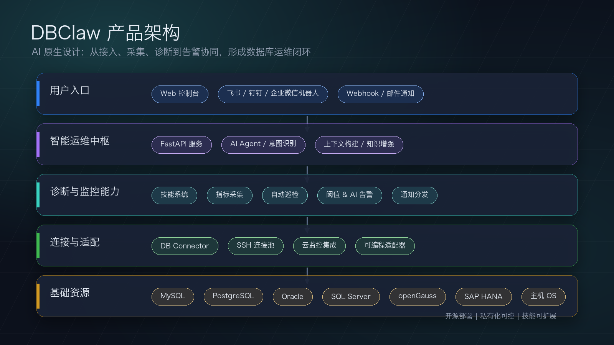
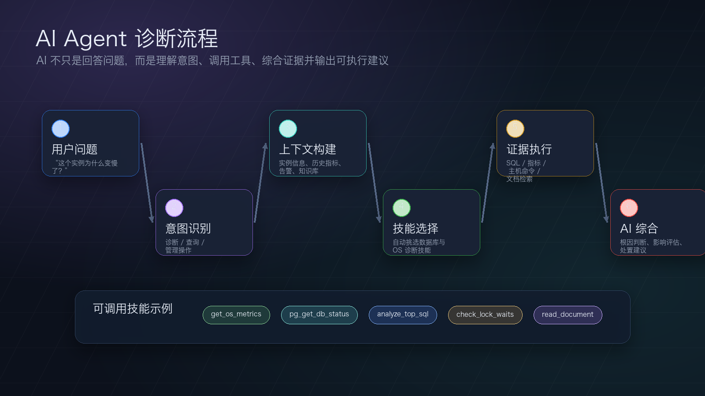
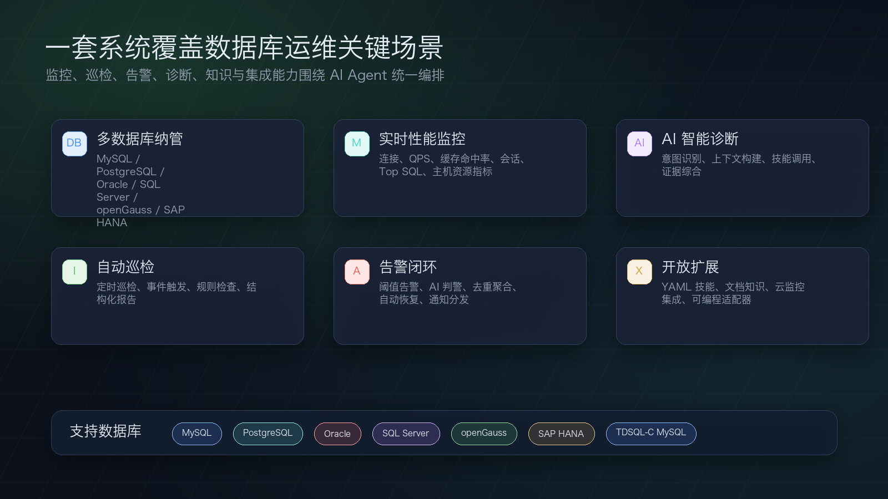
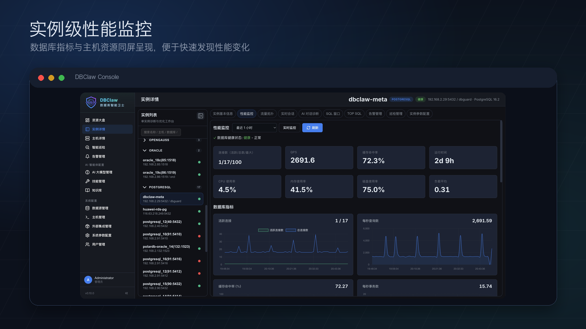
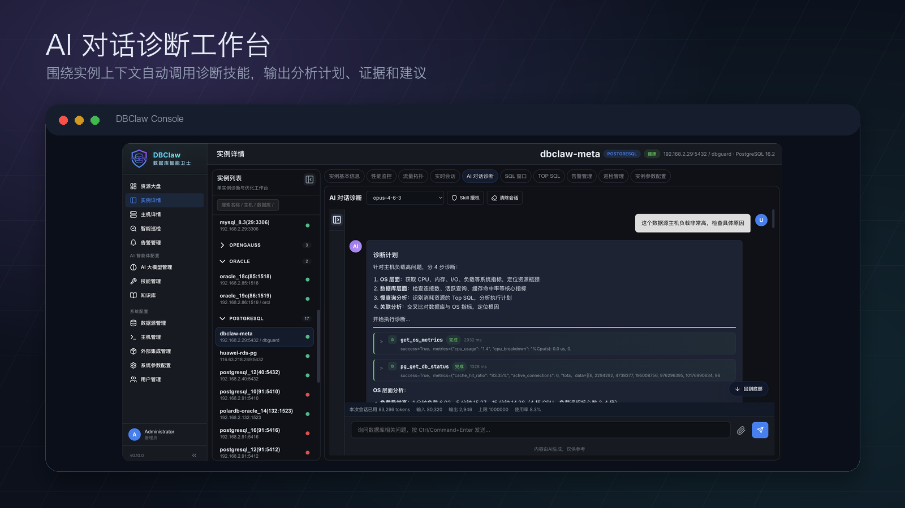
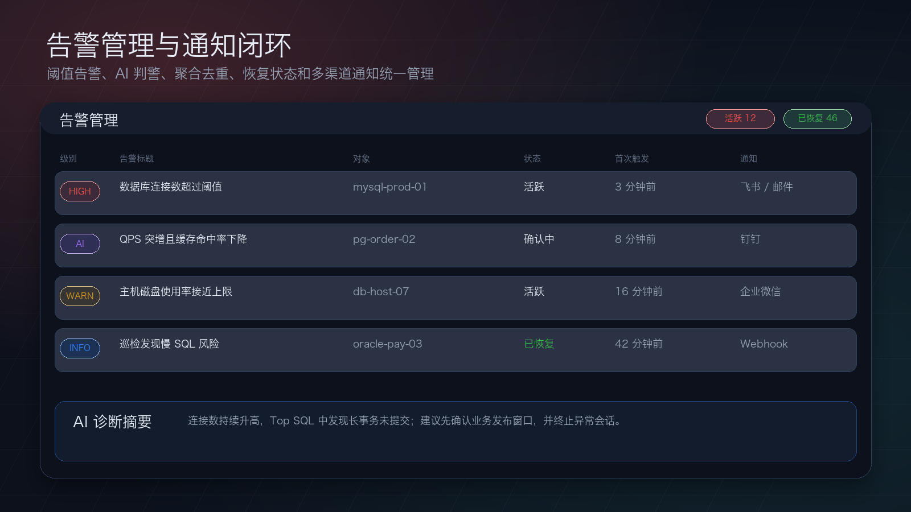

# DBClaw：AI 原生的开源数据库监控诊断系统

数据库运维正在进入一个新的阶段。

过去，我们依赖监控大盘、阈值告警、人工巡检和专家经验来发现问题、定位问题、解决问题。但在真实生产环境中，数据库类型越来越多，系统链路越来越复杂，问题往往不是一个指标异常那么简单。

慢 SQL、连接数飙升、锁等待、磁盘压力、主机资源瓶颈、复制延迟、实例不可用……这些问题背后，通常需要结合数据库指标、系统指标、历史趋势、配置状态和上下文信息综合判断。

这正是 DBClaw 想解决的问题。

DBClaw，中文名“数据库智能卫士”，是一套 **AI 原生的开源数据库监控诊断系统**，面向企业数据库运维、平台工程、DBA 团队和开发团队，提供智能诊断、主动监控、自动巡检和告警通知能力。

## 不只是监控系统，而是 AI 原生的数据库运维助手

很多系统是在传统监控能力之上“加一个 AI 问答框”。

DBClaw 的设计思路不同。

它从一开始就围绕 AI Agent 的工作方式构建：AI 不只是回答问题，而是可以理解用户意图、获取上下文、选择诊断技能、执行数据库分析，并最终给出可操作的结论。

当你问：

> 为什么这个 MySQL 实例今天变慢了？

DBClaw 不只是泛泛解释数据库变慢的原因，而是可以结合实例指标、历史趋势、慢查询、连接状态、主机资源等信息，辅助判断问题可能出在哪里，并给出下一步排查建议。

这就是 AI 原生数据库运维的价值：让系统从“展示数据”进化到“理解问题”。

## 产品架构：围绕 AI Agent 构建运维闭环

DBClaw 采用轻量、开放、易部署的架构：

- 后端基于 FastAPI，提供异步 API、监控采集、诊断编排和后台任务能力。
- 前端采用原生 JavaScript SPA，无需复杂构建流程。
- PostgreSQL 作为元数据存储，保存数据源、告警、巡检、模型配置和诊断记录。
- AI Agent、技能系统、知识增强、指标采集和通知分发共同构成智能运维中枢。

系统可以接入多种数据库和主机资源，也可以通过云监控集成、Webhook、IM 机器人和可编程适配器融入企业现有运维体系。

## AI 诊断流程：从提问到证据，再到建议

DBClaw 的 AI 诊断不是简单聊天，而是一套完整的智能诊断流程：

1. 用户提出数据库问题。
2. 系统识别问题意图。
3. 自动构建实例、指标、告警、知识库等上下文。
4. 挑选适合当前数据库类型和场景的诊断技能。
5. 执行 SQL、指标查询、主机命令或文档检索。
6. AI 综合证据，输出根因判断、影响评估和处置建议。

这让 AI 真正进入数据库运维现场，而不是停留在静态知识问答里。

## 产品亮点一：多数据库统一纳管

DBClaw 支持多种主流数据库类型：

- MySQL
- PostgreSQL
- Oracle
- SQL Server
- TDSQL-C MySQL
- openGauss
- SAP HANA

对于企业内部常见的异构数据库环境，DBClaw 可以帮助团队用统一的平台进行接入、监控、巡检和诊断，减少工具割裂带来的管理成本。

## 产品亮点二：实例级性能监控

DBClaw 提供实例级性能监控能力，覆盖数据库运行状态、连接数、QPS、缓存命中率、运行时间、CPU、内存、磁盘、负载等关键指标。

当数据库绑定主机后，系统可以把数据库指标与 OS 指标放在同一个分析视角里，帮助用户更快判断问题是来自数据库内部，还是来自主机资源瓶颈。

这对真实排障非常关键。

因为很多数据库问题并不是“数据库自己坏了”，而是 CPU、I/O、磁盘、网络、长事务、异常会话、慢 SQL 等多个因素叠加后的结果。

## 产品亮点三：AI 对话诊断工作台

DBClaw 内置 AI 对话诊断工作台。

用户可以围绕某个具体实例发起诊断，例如：

> 这个数据源主机负载非常高，检查具体原因。

系统会根据当前实例上下文生成诊断计划，并自动调用相关技能，例如：

- 获取 OS 指标
- 检查数据库状态
- 分析活跃连接
- 排查慢 SQL
- 对比历史趋势
- 检索知识文档

执行完成后，AI 会把过程中的证据组织起来，给出更贴近现场的分析结果。

对 DBA 来说，它是一个诊断助手；对研发和运维团队来说，它是降低数据库问题理解门槛的协作入口。

## 产品亮点四：主动巡检，而不是等故障发生

DBClaw 支持自动巡检能力，可以按数据源配置计划任务，对数据库运行状态进行周期性检查。

系统可以结合阈值规则、巡检结果和去重策略，帮助团队更早发现风险。

相比被动等待告警，主动巡检更适合发现那些“还没爆炸，但已经不太对劲”的问题，例如：

- 慢 SQL 数量持续增加
- 连接数接近上限
- 主机磁盘空间持续下降
- 缓存命中率异常波动
- 长事务或锁等待开始积累
- 巡检规则发现潜在配置风险

## 产品亮点五：告警、去重、恢复与通知闭环

DBClaw 提供完整的告警链路：

- 阈值告警
- AI 判警
- 告警去重
- 告警聚合
- 自动恢复
- 通知分发

通知方式支持 Webhook、邮件、钉钉、飞书、企业微信等常见渠道，方便接入企业现有协作流程。

告警不只是“响一下”，而是尽可能形成从发现、判断、通知到恢复的闭环。

## 产品亮点六：可扩展技能系统，沉淀团队经验

DBClaw 内置技能系统，将常见数据库诊断动作封装为可执行技能。

技能可以覆盖不同数据库类型、不同诊断场景和不同权限级别，例如：

- 查询连接状态
- 分析慢查询
- 检查锁等待
- 查看数据库指标
- 获取主机资源信息
- 执行特定数据库的诊断 SQL

这些技能既可以由系统自动调用，也可以成为 AI Agent 的工具能力。

更重要的是，技能是可扩展的。团队可以根据自己的数据库类型、业务场景和运维经验，持续沉淀专属诊断能力。

## 开源开放，适合企业二次开发

DBClaw 是开源数据库监控诊断系统，技术架构清晰、部署路径简单、扩展方式开放。

对于企业用户来说，开源意味着更高的可控性：

- 可以私有化部署。
- 可以按需扩展数据库类型。
- 可以接入内部监控系统。
- 可以沉淀自己的运维知识库。
- 可以定制诊断技能和告警策略。
- 可以与企业已有 IM、Webhook、邮件和云监控体系集成。

DBClaw 不是把 AI 做成一个装饰性入口，而是把 AI Agent 作为数据库运维流程的一部分，让它能够理解上下文、调用工具、组织证据，并输出可操作建议。

## DBClaw 适合谁？

DBClaw 适合以下团队和场景：

- DBA 团队：统一管理多种数据库，提升诊断效率。
- 运维团队：构建数据库监控、告警、巡检体系。
- 平台工程团队：为内部用户提供数据库可观测能力。
- 开发团队：快速理解数据库异常和性能问题。
- 中小团队：用开源方案搭建轻量但智能的数据库运维平台。

## 从“人找问题”到“AI 协助定位问题”

数据库运维的复杂度不会降低。

真正需要改变的，是我们处理复杂度的方式。

DBClaw 希望通过 AI Agent、诊断技能、监控指标、自动巡检和告警闭环，把数据库运维从传统的“人盯图表、人工排查”，推进到“AI 理解上下文、协助定位问题、沉淀诊断经验”的新阶段。

它不是要取代 DBA，而是让 DBA 的经验更容易被复用，让团队更快发现问题、理解问题、解决问题。

## 结语

DBClaw 是一款 **AI 原生的开源数据库监控诊断系统**。

它面向真实的数据库运维场景而设计，支持多数据库接入、智能诊断、主动巡检、告警通知和技能扩展，帮助团队构建更智能、更开放、更可持续的数据库运维体系。

如果你正在寻找一套可私有化、可扩展、面向 AI 时代的数据库监控诊断平台，欢迎关注 DBClaw。
